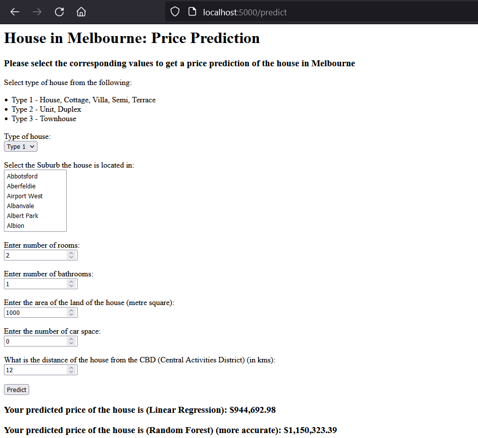

# Melbourne Housing: Price Prediction

### Tools Used:
1. [Github](https://github.com)
2. [VSCode](https://code.visualstudio.com)
3. [GitCLI](https://git-scm.com/downloads)

### Setup:
Create new environment for the application using Anaconda at the root project folder and install the required packages for python

```
$ conda create -p venv python==3.7 -y
$ conda activate venv
$ pip install -r requirements.txt
```

### Run:
Use the following command to run the Flask server on localhost

```
$ python ./src/n1.py
```

### Website
Open the following URL in the browser of your choice
```
http://localhost:{port}/
```

### API route:
Use the postman collection placed in the Resources folder to use the API
```
http://localhost:{port}/api/predict
```

### Screenshot
