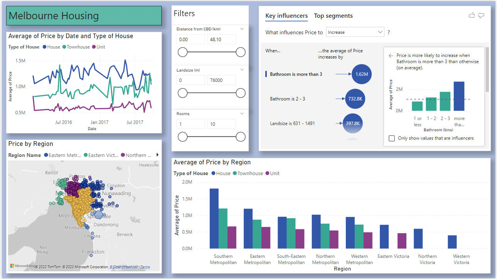
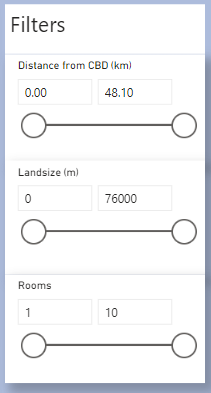
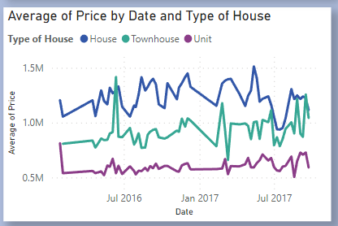
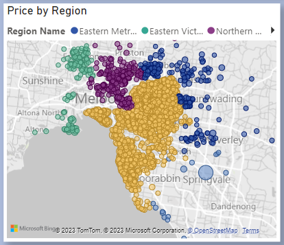
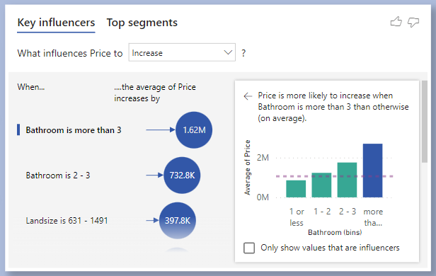
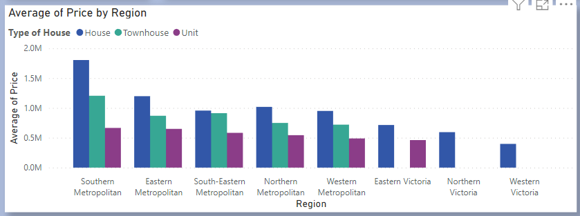

# Melbourne Housing: Price Prediction

Using the [Melbourne Housing dataset](https://www.kaggle.com/datasets/dansbecker/melbourne-housing-snapshot) from kaggle, generated a linear regression model and Random Forest Regressor to predict the house prices of Melbourne using the predictors: type of the house, suburb house is located in, distance of the house from CBD, number of bathrooms and rooms in the house, total landsize for the house, and car spaces.

Detailed analysis located in the "melbourne" jupyter notebook in the src folder for Linear Regression model.

<!-- ### Tools Used:
1. [Github](https://github.com)
2. [VSCode](https://code.visualstudio.com)
3. [GitCLI](https://git-scm.com/downloads) -->

### Setup:
Create new environment for the application using Anaconda at the root project folder and install the required packages for python

```
$ conda create -p venv python==3.7 -y
$ conda activate venv
$ pip install -r requirements.txt
```

### Run:
Use the following command to run the Flask server on localhost

```
$ python ./src/n1.py
```

### Website
Open the following URL in the browser of your choice
```
http://localhost:{port}/
```

### API route:
Use the postman collection placed in the Resources folder to use the API
```
http://localhost:{port}/api/predict
```

### Screenshot


### Power BI Dashboard


Brief description of each component is as follows:

1. Filters



In order to filter out data based on the distance of the house from the Central Business District, Landsize and number of rooms in the house we can have different average prices of each in different regions.

2. Average Price by Date and Type of House



Here in the line graph we can see that the prices of Units type of house were same as Townhouse initially, but it immediately dropped and stayed lower than all other types of houses. The 'house' type has higher average price. There seems to be large fluctuations in the average price of the houses during July 2016 and March 2017, otherwise the prices remain in same range with no rising trends through the year.

3. Price map



The map shows the different houses on sale in different region. The size of the bubble indicates the average price. Southern Metropolitan region has large number of houses on sale and we can observe a higher average price with large blue bubble for South-Eastern Metropolitan.

4. Key Influencers



This component shows the key influencers the price to increase. The number of bathrooms in the house is the highest influencer and number of rooms influences the rise in prices the least.

5. Average Price by Region



We observe the overall average price of all type of houses is higher in the Southern Metropolitan region, and we can observe that the Northern Victoria and Western Victoria region do not have Townhouse and Unit type of houses on sale. Similarly, Eastern Victoria region do not have any townhouses for sale.

### Future work
The flask app can be hosted on any cloud platform or can be containerized. Can deploy the app as backend and use a separate Angular or React frontend for better user experience.
